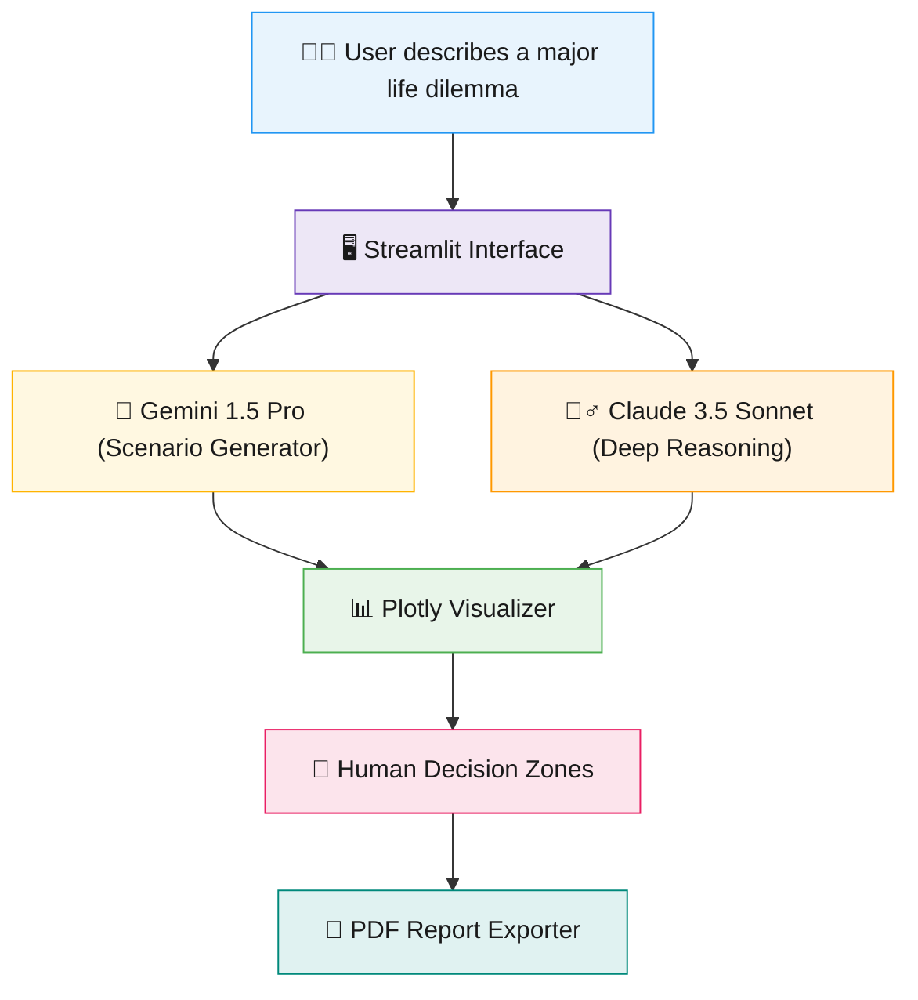

# 🔮 LifeLens AI 

> **Your life decision simulator — AI computes the logic, you keep the power.**

Life's biggest decisions (career changes, grad school, startups, relocation) require weighing financial, emotional, and relational factors simultaneously. **LifeLens AI** bridges this gap: a decision simulator that uses dual-AI reasoning to model your future paths, but explicitly hands the final power back to you by defining what machines *cannot* feel. 

Built for the **USAII Global AI Hackathon 2026 (Undergraduate Track)** with **Google Gemini** + **Anthropic Claude**.

🔗 **Live Demo:** [Add your Streamlit Cloud Link Here]
⚙️ **GitHub Repo:** [Add your Repo Link Here]

---

## ✨ Key Features

* 🔀 **Multi-AI Architecture:** Why use one brain? **Gemini 1.5 Pro** generates creative, realistic future scenarios, while **Claude 3.5 Sonnet** performs deep tradeoff reasoning and regret minimization.
* 🎯 **Explicit Human Decision Zones:** Unlike AI that pretends to know it all, LifeLens explicitly refuses to make your choice. It isolates factors AI cannot compute (Emotional Weight, Relationships, Intuition, Values).
* 🔥 **Devil's Advocate Mode:** A built-in guardrail that brutally challenges your safest option to break confirmation bias and test your true resolve.
* 🎚️ **The "Gut Check" System:** Users rate their intuition against the AI's logical confidence score to find their actual alignment.
* 📊 **Interactive Visualizations:** Deep tradeoff mapping and risk comparisons built with Plotly.
* 📄 **Professional PDF Export:** Generate a clean, structured report using ReportLab to share with real-world mentors and family.
* 📴 **Graceful Offline Fallback:** Never crashes. If APIs hit rate limits, the system seamlessly transitions into an Offline Demo Mode with pre-loaded case studies.

---

## 🏗️ Architecture



**How a query flows:**
1. **User asks** — describes their life decision and toggles advanced settings (like Devil's Advocate).
2. **Gemini builds futures** — creates 3-4 highly specific, 5-year outlook paths.
3. **Claude critiques** — tears down assumptions, highlights hidden risks, and applies Jeff Bezos' Regret Minimization Framework.
4. **Human steps in** — the user evaluates their "Gut Feeling" and reads through the 4 Human Pillars (emotions, relationships, values, intuition).
5. **Decision exported** — everything is wrapped into a clean PDF for offline discussion.

---

## 🛠️ Tech Stack

We implemented a decoupled modular architecture for clean UI and heavy AI lifting:

| Layer | Technology |
|---|---|
| 🖥️ Frontend UI | Streamlit |
| 🧠 Scenario Engine | Google Gemini API (gemini-pro) |
| 🕵️‍♂️ Reasoning Engine | Anthropic Claude API (claude-3-5-sonnet) |
| 📊 Data Visualization | Plotly |
| 📄 Document Generation | ReportLab |
| ☁️ Deployment | Streamlit Cloud |

---

## 📂 Project Structure

```text
├── app.py                     # Main Streamlit interface and UI orchestration
├── modules/
│   ├── scenario_engine.py     # Handles dual AI calls (Gemini + Claude)
│   ├── human_zones.py         # Rule-based logic for Human-in-the-loop guardrails
│   ├── visualizer.py          # Plotly chart generation for tradeoffs
│   └── pdf_export.py          # ReportLab formatting for final takeaways
├── requirements.txt           # Python dependencies
├── .env.example               # Template for API keys
└── .gitignore                 # Keeps API keys out of version control
```

---

## ⚙️ Setup & Run Locally

### Prerequisites
- Python 3.9+
- A [Google Gemini API Key](https://aistudio.google.com/)
- An [Anthropic Claude API Key](https://console.anthropic.com/)

### 1. Clone & install

```bash
git clone [https://github.com/YOUR-USERNAME/lifelens-ai.git](https://github.com/YOUR-USERNAME/lifelens-ai.git)
cd lifelens-ai
pip install -r requirements.txt
```

### 2. Configure environment

Create a `.env` file in the project root:

```env
GEMINI_API_KEY=your_gemini_api_key_here
CLAUDE_API_KEY=your_claude_api_key_here
```

### 3. Run the app

```bash
streamlit run app.py
```

---

## 🚧 Challenges We Solved

- **Dual-API Orchestration:** Getting Gemini to output strict JSON for scenarios, and then passing that dynamic JSON safely into Claude's prompt context without breaking the parsing logic.
- **Graceful Failures:** New API accounts often face strict rate limits. We built a robust `try-except` fallback that loads high-quality offline demo data instead of throwing ugly red error boxes at the user.
- **UI/UX Psychology:** Making sure the app doesn't feel like a dictator. We spent significant time designing the "Human Decision Zones" UI so users physically feel the hand-off of power from the AI back to them.

---

## 🔮 What's Next

- 👥 **Multi-Stakeholder Mode:** Allow users to input their parents' or partners' perspectives to see how a decision impacts the whole family ecosystem.
- 🔗 **Career API Integrations:** Pull real-time salary and housing cost data into the scenarios.
- 📱 **Mobile-Optimized PWA:** Making the Gut-Check sliders more tactile and touch-friendly for on-the-go reflection.

---

## 📜 License

This project is open-source and available under the **MIT License**.
